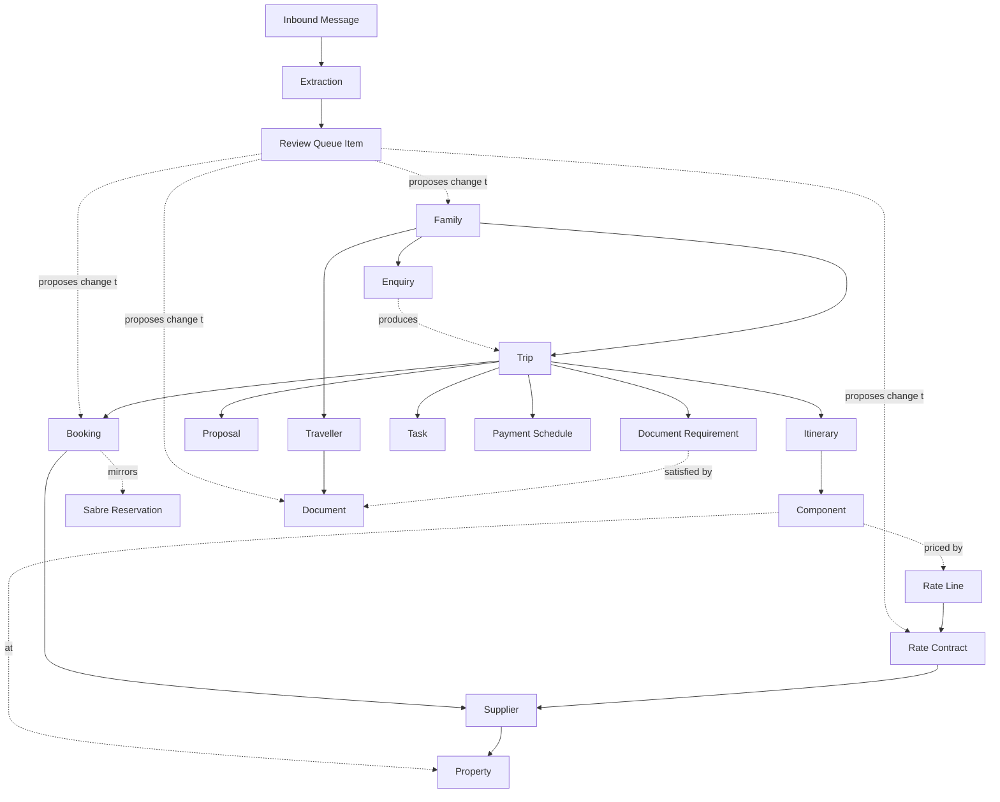

# PureLuxe Studio — Domain Model

**For:** CTO review, before any database design
**Date:** 25 July 2026
**Follows:** [01-product-vision.md](01-product-vision.md) v1.0
**Status:** Implementation-independent. No storage, no APIs, no UI.

---

## How to read this document

This models the *business*, not the system. Every concept here should be recognisable to Priya or Rahul without explanation — if a concept needs an engineer to explain it, it's wrong and should be removed.

Three conventions are used throughout:

- **Aggregate root** — a concept that owns a consistency boundary. You change it as a whole, and its internal rules are always true.
- **Entity** — has identity and a lifecycle, but lives inside an aggregate.
- **Value object** — defined entirely by its values, has no identity, is replaced rather than edited.

The one modelling principle that drove most decisions here: **aggregates are split along the lines of who changes them and when.** Things a consultant edits while designing a trip belong together. Things a supplier, Sabre, or a payment advice changes asynchronously belong apart. This is why Booking and Payment are not inside Trip.

---

## 1. Core Business Concepts

### 1.1 People and Relationships

---

#### Family — *aggregate root*

**Purpose.** The account the agency sells to. The agency's clients are households and multi-generational groups, not individuals; the Family is where relationship, memory, value and preference live.

**Responsibilities.** Holds its members. Owns family-level preferences (always villas, never early departures). Knows its relationship owner, tier and lifetime value. Guarantees exactly one principal contact. Enforces that a member belongs here and nowhere else.

**Lifecycle.** Prospective → Active → Dormant → Archived. A Family is created at first qualified enquiry and effectively never dies; Archived means "no longer sold to," not deleted, because history is the asset.

**Ownership.** *Context:* CRM. *Business owner:* the relationship-owning Travel Consultant; the Founder can reassign.

**Relationships.** Contains Travellers. Referenced by Enquiries, Trips, Communications, Payment Schedules. May be linked to other Families for group travel (a peer link, not containment).

---

#### Traveller — *entity within Family*

**Purpose.** A specific person who travels. The subject of documents, seat preferences, loyalty numbers and dietary needs.

**Responsibilities.** Holds identity details as the agency knows them, personal preferences, loyalty memberships, and the family role (principal contact, payer, minor, elder, assistant). Knows its own document set by reference.

**Lifecycle.** Draft (named but not yet detailed) → Complete (enough detail to travel) → Inactive. A minor becoming an adult is an attribute change, not a lifecycle change.

**Ownership.** *Context:* CRM, inside the Family aggregate — a Traveller has no meaning without a Family. *Business owner:* the family's consultant.

**Relationships.** Belongs to exactly one Family. Referenced by Trips (as a party member), Bookings (as the named traveller), Documents, and Sabre Reservations.

**Note.** Traveller is *inside* the Family aggregate but *referenced by identity* from everywhere else. This is deliberate: membership rules must hold instantly, while a Booking naming a traveller does not need the Family loaded to be valid.

---

#### Supplier — *aggregate root*

**Purpose.** Any party the agency buys from: hotel, DMC, transport operator, guide, experience provider.

**Responsibilities.** Holds contacts, commercial terms, contracted status, payment terms, and accumulated performance signals (responsiveness, issues raised).

**Lifecycle.** Prospective → Active → Preferred → Suspended → Archived.

**Ownership.** *Context:* Rates & Supply. *Business owner:* Administrator for master data; Founder for the relationship.

**Relationships.** Supplies Properties. Party to Rate Contracts. Named on Bookings. Sends Inbound Messages.

---

#### Property — *aggregate root*

**Purpose.** A specific sellable place — hotel, villa, camp, lodge. The thing a consultant chooses when designing a trip.

**Responsibilities.** Holds location, category, room types, seasons, and descriptive content used in itineraries.

**Lifecycle.** Draft → Published → Under review → Retired.

**Ownership.** *Context:* Rates & Supply. *Business owner:* Administrator.

**Relationships.** Offered by one or more Suppliers (a property can be bought direct or through a DMC — this matters commercially). Priced by Rate Contracts. Referenced by Itinerary Components and Bookings.

---

### 1.2 Demand and Design

---

#### Enquiry — *aggregate root*

**Purpose.** A stated intention to travel, before it is a trip. The unit of pipeline.

**Responsibilities.** Captures source and channel, requested destinations, dates, party shape and budget band. Knows its owner, its qualification state, its age, and — if lost — why.

**Lifecycle.** Captured → Qualified → In Design → Won → *(or)* Lost → Archived. An Enquiry is never edited into a Trip; it *causes* one and continues to exist as the record of demand.

**Ownership.** *Context:* Enquiry & Pipeline. *Business owner:* assigned Travel Consultant.

**Relationships.** Belongs to one Family (creating a prospective Family if new). Produces at most one Trip. May originate from an Inbound Message.

---

#### Trip — *aggregate root, core of the model*

**Purpose.** One journey for one Family: the thing being designed, sold, operated and remembered.

**Responsibilities.** Owns the travelling party, the date range and destinations, the Itinerary, and the commercial position (cost, sell, margin). Guarantees the itinerary is internally coherent — no overlapping accommodation, no day segment outside the trip dates, no traveller on the trip who isn't in the Family.

**Lifecycle.** Draft → Proposed → Confirmed → In Progress → Completed → Archived, with Cancelled reachable from Proposed, Confirmed or In Progress.

**Ownership.** *Context:* Travel Planning. *Business owner:* the Travel Consultant until confirmation; jointly with Operations afterwards.

**Relationships.** Belongs to one Family. Names Travellers as its party. Contains an Itinerary. Referenced by Bookings, Tasks, Proposals, Payment Schedule, Documents (via requirements) and Communications.

---

#### Itinerary — *entity within Trip*

**Purpose.** The structured shape of the journey — what happens on which day.

**Responsibilities.** Orders Days; each Day holds Components. Enforces chronological integrity.

**Lifecycle.** Has no independent lifecycle; it lives and dies with its Trip. It is versioned only in the sense that Proposals snapshot it.

**Ownership.** *Context:* Travel Planning, inside the Trip aggregate.

**Relationships.** Contains Itinerary Components.

---

#### Itinerary Component — *entity within Trip*

**Purpose.** One sellable element: a stay, a flight, a transfer, an experience, a free day.

**Responsibilities.** Holds what it is, when, for whom (which subset of the party), the chosen Rate reference if any, and its own cost and sell price. Knows whether it is priced from a contract or entered manually.

**Lifecycle.** Proposed → Selected → Booked → Delivered → Cancelled. Component state is a *reflection* of its Booking, not a second source of truth.

**Ownership.** *Context:* Travel Planning, inside the Trip aggregate.

**Relationships.** May reference a Property, a Supplier, and a Rate Line. Is realised by at most one Booking.

---

#### Proposal — *aggregate root*

**Purpose.** What was actually shown to the client, exactly as they saw it.

**Responsibilities.** Holds an **immutable snapshot** of the itinerary and pricing at the moment of sending, plus its version number, recipient and sent time. Answers "which version did they accept?" without inference.

**Lifecycle.** Draft → Sent → Accepted → *(or)* Superseded → *(or)* Declined. Once Sent, it can never change.

**Ownership.** *Context:* Travel Planning. *Business owner:* Travel Consultant.

**Relationships.** Snapshots one Trip. A Trip has many Proposals over time; at most one is Accepted.

**Why an aggregate of its own.** The Trip keeps changing; the proposal must not. Making Proposal a separate immutable aggregate is what makes "documents are outputs, never sources" structurally true rather than a matter of discipline.

---

### 1.3 Commerce

---

#### Rate Contract — *aggregate root, strategic asset*

**Purpose.** A negotiated commercial agreement with a Supplier for one or more Properties. The agency's actual edge over public OTAs.

**Responsibilities.** Holds validity window, currency, commission or net terms, cancellation policy, blackout dates, and its Rate Lines. Knows its own freshness and whether it is currently quotable. Carries a link to the source contract document for verification.

**Lifecycle.** Draft → Under review (in the queue) → Active → Expiring → Expired → Superseded. Contracts are *superseded*, never edited in place — last year's terms must remain readable to explain last year's trip.

**Ownership.** *Context:* Rates & Supply. *Business owner:* Administrator, with Founder authority on terms.

**Relationships.** Between the agency and one Supplier, covering one or more Properties. Contains Rate Lines. Referenced by Itinerary Components and Bookings.

---

#### Rate Line — *entity within Rate Contract*

**Purpose.** One priced row: this room category, this season, this occupancy, this price.

**Responsibilities.** Holds room category, date range, occupancy basis, net and/or published price, inclusions and minimum stay as structured values — not prose.

**Lifecycle.** Follows its contract.

**Ownership.** *Context:* Rates & Supply, inside the Rate Contract aggregate.

**Relationships.** Prices a Property room category. Referenced (by identity, with the price copied at selection time) by Itinerary Components.

---

#### Booking — *aggregate root*

**Purpose.** A commitment made with a supplier — the agency's record of what has actually been secured.

**Responsibilities.** Holds supplier, reference number, status, hold expiry, cancellation deadline and terms, and the agreed cost. Knows which Trip and which Itinerary Component it realises, and which Travellers it names.

**Lifecycle.** Requested → Held → Confirmed → Delivered → *(or)* Cancelled → *(or)* Lapsed (a hold that expired without action). Lapsed is a distinct, important state: it is a failure, not a cancellation.

**Ownership.** *Context:* Booking. *Business owner:* Travel Consultant before confirmation, Operations after.

**Relationships.** Belongs to exactly one Trip. Realises at most one Itinerary Component. Names one Supplier and one or more Travellers. May mirror a Sabre Reservation.

**Why not inside Trip.** Bookings change on the outside world's schedule — a supplier confirms at midnight, a hold lapses, Sabre reports a schedule change. Putting them inside the Trip aggregate would mean every external event contends with a consultant editing an itinerary.

---

#### Sabre Reservation — *aggregate root, in an anti-corruption layer*

**Purpose.** The agency's local reflection of a reservation that lives in Sabre. **Sabre is upstream and authoritative; this is a mirror, never a master.**

**Responsibilities.** Holds the record locator, the segments and passengers as Sabre reports them, ticketing deadlines, and — most importantly — a **Sync State**: In Sync, Diverged, Unmatched, or Stale. Knows when it was last checked. Never silently reconciles a difference.

**Lifecycle.** Discovered → Matched → In Sync ⇄ Diverged → Resolved → Closed. An Unmatched reservation (a PNR nobody has attached to a trip) is a legitimate resting state that must be visible, not an error to be swallowed.

**Ownership.** *Context:* Sabre Sync. *Business owner:* Operations.

**Relationships.** May be matched to one Booking and thereby one Trip. Names Travellers by mapping Sabre passenger records onto known Travellers — a mapping that can fail and must then be reviewed by a human.

---

#### Payment Schedule — *aggregate root*

**Purpose.** What the client owes and when, and what the agency owes suppliers and when.

**Responsibilities.** Holds ordered Payment Milestones with due dates and amounts. Knows what is outstanding, what is overdue, and whether the trip is financially clear to travel.

**Lifecycle.** Draft → Active → Settled → *(or)* Written Off.

**Ownership.** *Context:* Trip Money. *Business owner:* Operations.

**Relationships.** Belongs to one Trip. Contains Payment Milestones. Receives Payments.

---

#### Payment Milestone — *entity within Payment Schedule*

**Purpose.** One expected movement of money: deposit, second instalment, final balance, supplier payment.

**Lifecycle.** Pending → Due → Part Paid → Paid → *(or)* Overdue → *(or)* Waived.

**Relationships.** Satisfied by one or more Payments.

---

#### Payment — *entity within Payment Schedule*

**Purpose.** A recorded receipt or disbursement of money.

**Responsibilities.** Amount, currency, date, method, reference, and which milestone it satisfies. It is a *record of a fact*, never an instruction — the platform does not move money.

**Lifecycle.** Recorded → Confirmed → *(or)* Reversed. Immutable once confirmed; corrections are new entries.

---

### 1.4 Operations

---

#### Task — *aggregate root*

**Purpose.** A unit of work that must happen by a date, so that no obligation depends on memory.

**Responsibilities.** Holds what must be done, by whom, by when, and why it exists (which rule generated it). Knows whether it is blocking departure. Escalates itself when overdue.

**Lifecycle.** Generated → Open → In Progress → Completed → *(or)* Cancelled → *(or)* Overdue (a condition overlaid on Open, not a terminal state).

**Ownership.** *Context:* Operations. *Business owner:* the assigned Operations Executive.

**Relationships.** Usually belongs to a Trip; may belong to a Family, a Booking, a Document or a Rate Contract. Generated by policy, not by hand — a manually created task is the exception.

---

#### Trip Readiness — *derived concept, not stored as truth*

**Purpose.** The answer to "is this trip safe to depart?"

**Responsibilities.** Evaluates, at any moment: are all bookings confirmed, all required documents valid through the travel dates, all payment milestones met, all blocking tasks closed. Produces a list of violations.

**Lifecycle.** None — it is computed, always, from current state. **This is deliberately not an entity.** Storing readiness as a field invites it to be wrong.

**Relationships.** Reads Trip, Bookings, Documents, Payment Schedule and Tasks.

---

#### Document — *aggregate root*

**Purpose.** A piece of evidence about a person — passport, visa, insurance certificate, ID.

**Responsibilities.** Holds the file, its kind, its extracted structured detail, its issue and expiry dates, and its verification state. Knows who may see it and records every access. Knows its own retention deadline.

**Lifecycle.** Requested → Received → Verified → Valid → Expiring → Expired → Purged. *Requested* matters: a document the agency has asked for and not received is a domain fact worth modelling, because it drives chasing.

**Ownership.** *Context:* Documents. *Business owner:* Operations.

**Relationships.** **Belongs to exactly one Traveller** — never to a Trip. Trips *satisfy requirements* using a traveller's documents. This is what makes a passport collected once never chased again.

---

#### Passport — *typed detail of Document, not a separate concept*

**Purpose.** The most consequential document kind, with structured fields that drive rules: number, nationality, issue and expiry date, place of issue.

**Why not its own entity.** Passport, visa and insurance share one lifecycle, one vault, one access model and one expiry mechanic. Modelling them as one Document with typed detail keeps the rules in one place; modelling them as separate entities would duplicate all of it three times.

**Relationships.** Its expiry drives Document Requirement satisfaction and generates Tasks.

---

#### Document Requirement — *value object derived from policy*

**Purpose.** What a specific Trip needs from a specific Traveller — "a passport valid for six months beyond the return date," "a Schengen visa," "travel insurance."

**Responsibilities.** Derived from destination rules and traveller nationality. Knows whether it is satisfied, by which document, and when that satisfaction expires.

**Lifecycle.** None — recomputed as the trip, the destinations or the documents change.

**Relationships.** Binds a Trip, a Traveller and (when satisfied) a Document.

---

### 1.5 Intake and Trust

---

#### Inbound Message — *aggregate root*

**Purpose.** Something that arrived from outside: today an email, tomorrow a WhatsApp message. The raw material of the business.

**Responsibilities.** Holds sender, subject, body, attachments, channel and arrival time, exactly as received. **Immutable.** Knows what it was classified as and what was extracted from it, by reference.

**Lifecycle.** Received → Classified → Extracted → Proposed → Resolved → *(or)* Ignored (correctly identified as irrelevant) → *(or)* Unprocessable.

**Ownership.** *Context:* Intake. *Business owner:* the review queue's daily owner.

**Relationships.** May be matched to a Family, Trip, Supplier or Booking. Produces Extractions. Is also surfaced as a Communication if it is genuine correspondence.

**Language note.** Operators say "email" and will keep saying it. The concept is named Inbound Message because email is the *first* channel, not the only one — this single naming decision is what makes WhatsApp a second channel rather than a second pipeline.

---

#### Extraction — *entity within Inbound Message*

**Purpose.** What the machine believes a message means.

**Responsibilities.** Holds the classified kind (rate sheet, supplier confirmation, PNR, passport, enquiry, payment advice), the extracted fields, a confidence score per field, the proposed match to existing records, and which model version produced it. **Holds no authority whatsoever.**

**Lifecycle.** Produced → Proposed → Superseded (by a re-extraction).

**Relationships.** Belongs to one Inbound Message. Gives rise to a Review Queue Item.

---

#### Review Queue Item — *aggregate root, the trust layer*

**Purpose.** A **proposed change to the business, awaiting a human decision.** This is the single most important structural concept in the model.

**Responsibilities.** Holds the proposed change as a self-describing payload, the evidence behind it (source message, confidence, model version), the target it would affect, and its risk class. Records the decision: who decided, when, what they corrected. **It never modifies anything itself** — accepting it emits an instruction that the owning context chooses to honour.

**Lifecycle.** Raised → Pending → Accepted → Applied → *(or)* Corrected → Applied → *(or)* Rejected → *(or)* Auto-Accepted (only within a named policy) → *(or)* Expired (the world moved on).

**Ownership.** *Context:* Intake. *Business owner:* Operations, as daily queue owner.

**Relationships.** Arises from an Extraction. Targets exactly one aggregate in exactly one other context. Produces a Provenance record on whatever it creates or changes.

**Why it is an aggregate and not a workflow step.** Because a proposal is a real business object with its own lifecycle, its own audit obligations and its own failure modes — including going stale. Treating it as a transient step in a pipeline loses all of that.

---

#### Provenance — *value object attached to changed records*

**Purpose.** How this fact came to be true.

**Responsibilities.** Names the source (which message), the proposer (which model version, or a human), the approver (which human, or which auto-accept policy), and the time. Travels with the record permanently.

**Why it matters.** It is what lets anyone answer "where did this rate come from and who signed off on it?" — the question that determines whether the agency ever trusts the AI enough to widen its authority.

---

### 1.6 Memory

---

#### Communication — *aggregate root*

**Purpose.** A real exchange with a real person — client or supplier — regardless of channel.

**Responsibilities.** Holds direction (inbound/outbound), channel, participants, content, and what it concerns. Groups into Threads. Knows whether it was sent by a human or drafted by a machine and approved.

**Lifecycle.** Drafted → Approved → Sent → Delivered *(outbound)*; Received → Filed *(inbound)*.

**Ownership.** *Context:* Conversations. *Business owner:* whoever owns the relationship.

**Relationships.** Belongs to a Thread. Concerns a Family, a Trip, a Supplier or a Booking. An Inbound Message may become a Communication — the same arrival is both raw material for Intake and correspondence for Conversations, seen through two different lenses.

---

#### Timeline Event — *read model, never written to directly*

**Purpose.** The human-readable story of everything that happened to a Family or a Trip.

**Responsibilities.** Presents domain events, communications, state changes, document uploads and task completions in one ordered narrative.

**Lifecycle.** None. It is *derived* from Domain Events.

**Critical distinction.** A Communication is a message that happened. A Timeline Event is an entry in a story. **Nothing in the business writes a Timeline Event directly** — if code ever does, the timeline has become a second source of truth and will drift from the first.

---

#### Operator — *aggregate root*

**Purpose.** A person who uses the platform: consultant, ops executive, founder, administrator.

**Responsibilities.** Holds identity, roles, sensitivity-tier grants, and assignment. Is the actor recorded in every Provenance and every audit entry.

**Lifecycle.** Invited → Active → Suspended → Departed. Departed is never deleted — attribution must survive people leaving.

**Ownership.** *Context:* Administration.

**Relationships.** Owns Families, Trips, Tasks. Decides Review Queue Items.

**Language note.** *Operator* is used here for the internal staff member, reserving *User* for the day a client can log in. Getting this right now avoids a painful rename later.

---

### 1.7 Shared Value Objects

| Value object | Meaning |
|---|---|
| **Money** | Amount plus currency, always together. Never a bare number. |
| **Date Range** | Inclusive start and end. Used for stays, seasons, contract validity, travel dates. |
| **Party** | The set of Travellers on a trip or a component, with occupancy shape (adults, children, ages). |
| **Confidence** | A machine's stated certainty about one extracted field. Never used as authority — only as routing. |
| **Sync State** | In Sync, Diverged, Unmatched, Stale. Applies to any mirrored external record. |
| **Provenance** | Source, proposer, approver, time. |
| **Commercials** | Cost, sell, margin — derived, always consistent, never independently editable. |
| **Destination Policy** | Visa, passport-validity and lead-time rules for a destination and nationality. Drives Document Requirements and Tasks. |

---

## 2. Ubiquitous Language

The vocabulary is not decoration. If the code says `customer` and the consultant says "family," every conversation costs a translation, and translations are where meaning is lost.

### Use / never

| Use | Never | Why |
|---|---|---|
| **Family** | Customer, Client, Account, Contact | The agency sells to households. "Customer" implies one buyer and quietly destroys the family model. |
| **Traveller** | Passenger, Guest, Person, End User | Passenger is Sabre's word for a segment occupant. Guest is a hotel's word. Traveller is ours. |
| **Enquiry** | Lead, Opportunity, Request | Sales-CRM words that import a funnel this business doesn't run. |
| **Trip** | Project, Job, Case, Order, Package | A trip is a journey, not a work item. |
| **Itinerary** | Plan, Schedule | Itinerary is the structured journey; a Proposal is what the client saw. |
| **Proposal** | Quote, Estimate, Offer, Document | A Proposal is a versioned, sent, immutable snapshot. "Quote" implies price only. |
| **Booking** | Reservation | **Reserved word.** A Booking is *our* commitment record. A **Reservation** is the *external* record in Sabre or a supplier's system. Conflating them makes the sync layer incoherent. |
| **Rate Contract** | Price list, Tariff, Rate card | A contract has parties, validity and terms. A price list has none of those. |
| **Offline Rate** | Special rate, Deal, Discount | "Offline" names the strategic fact: it is not publicly available. |
| **Supplier** | Vendor, Partner | Vendor is procurement language; Partner is ambiguous. |
| **Property** | Hotel | Hotels are one kind. Villas, camps and lodges are others. |
| **Document** | File, Attachment, Upload | A Document is evidence about a person with a lifecycle. A file is bytes. |
| **Task** | Reminder, To-do, Ticket | Tasks are generated by rules and block departure. Reminders are personal and optional. |
| **Review Queue Item** | Suggestion, Draft, Pending record | It is a *proposed change*, not a half-made record. The distinction is the whole safety model. |
| **Inbound Message** | Email | Email is today's channel. The concept must outlive it. |
| **Operator** | User, Agent, Staff | *User* is reserved for the future client. *Agent* means a travel agent to this business and an AI to engineers — banned outright. |
| **Communication** | Message, Note, Chat | A Communication is an exchange with someone outside the agency. Internal remarks are **Notes**. |
| **Timeline Event** | Log, History, Activity | Timeline is a narrative read model, not a log. |
| **Sync State** | Status | "Status" is overloaded past usefulness. Sabre records have a Sync State; bookings have a Booking Status. |

### Terms with precise, non-obvious meanings

- **Held** — a supplier is holding space that we have not paid for and that expires. Not confirmed.
- **Lapsed** — a hold that expired without action. An operational failure, distinct from Cancelled.
- **Diverged** — our record and Sabre's disagree, and no one has decided which is right.
- **Unmatched** — a reservation exists in Sabre that no one has attached to a trip.
- **Stale** — data whose freshness window has passed: an unchecked reservation, an expiring rate contract.
- **Proposed** — a machine's opinion. Carries no authority until a human accepts it.
- **Applied** — an accepted proposal has actually changed a record. Accepted ≠ Applied.
- **Quotable** — a rate contract that is active, in-date and not superseded. Only quotable rates may price a component.
- **Blocking** — a task or requirement that must clear before departure.
- **Readiness** — computed, never stored.

### Words banned outright

*Customer, User* (for staff), *Agent, Record* (as a noun for a business concept), *Object, Entity* (in business conversation), *Sync* (as a verb meaning "copy" — we reconcile).

---

## 3. Bounded Contexts

Ten contexts. Each owns its concepts, its language and its rules. The classification matters as much as the split: **core** contexts are where the agency's advantage lives and deserve the best thinking; **supporting** contexts are necessary and specific; **generic** contexts should be as boring as possible.

| Context | Type | Owns | Does not own |
|---|---|---|---|
| **Intake** | Core-enabling | Inbound Message, Extraction, Review Queue Item, Provenance | Any business record it proposes changes to |
| **CRM** | **Core** | Family, Traveller, preferences, relationship ownership | Trips, documents, money |
| **Travel Planning** | **Core** | Trip, Itinerary, Component, Proposal, commercials | Bookings, rates, tasks |
| **Rates & Supply** | **Core** | Rate Contract, Rate Line, Supplier, Property | Bookings, trips |
| **Enquiry & Pipeline** | Supporting | Enquiry, pipeline states, loss reasons | Families, trips |
| **Booking** | Supporting | Booking, supplier commitments, holds and deadlines | Sabre's truth, itinerary design |
| **Sabre Sync** | Supporting *(anti-corruption layer)* | Sabre Reservation mirror, Sync State, divergence, mapping | Bookings, trips — it never writes to them directly |
| **Operations** | Supporting | Task, task-generation policy, readiness evaluation | The records it reads |
| **Documents** | Supporting | Document, requirements, expiry, vault access, retention | Travellers, trips |
| **Trip Money** | Supporting | Payment Schedule, Milestones, Payments | Accounting, invoicing, ledgers |
| **Conversations** | Supporting *(future seam)* | Communication, Thread, Note | Extraction, business records |
| **Administration** | Generic | Operator, roles, permissions, audit, master data stewardship | Business decisions |
| **Reporting** | Generic *(downstream)* | Read models, Timeline, dashboards, metrics | Nothing — it is read-only, always |

### Why these boundaries

**Intake is separate from everything it touches.** The single most important boundary in the model. If extraction could write into CRM or Rates directly, "AI never commits" would be a coding convention rather than a structural fact. Intake produces *proposals*; other contexts decide whether to honour them.

**Conversations is separate from Intake** even though both handle arriving messages. Intake asks *"what does this mean and what should change?"* Conversations asks *"who said what to whom, and when?"* The same email is raw material to one and correspondence to the other. Merging them would mean either the AI pipeline owns the client relationship record, or the correspondence log owns extraction — both wrong, and the split is what makes WhatsApp addable later.

**Sabre Sync is an anti-corruption layer, not an integration.** Sabre's language (PNR, segment, passenger, record locator) stops at this boundary and is translated into ours (Booking, Component, Traveller). Nothing downstream should ever know what a record locator is. This is what keeps a GDS peculiarity from leaking into the trip model.

**Rates & Supply is core, not master data.** It would be easy to file Suppliers and Properties under Administration as reference data. That would be a strategic error: the rate repository is one of the two assets the whole business rests on, and treating it as a lookup table guarantees it gets built like one.

**Reporting is downstream and read-only.** It subscribes to events and builds its own views. It never asks another context for permission and never writes back. This is why a wrong dashboard can never corrupt the business.

---

## 4. Aggregate Roots

| Aggregate root | Consistency boundary | Why it is a root |
|---|---|---|
| **Family** | Family + Travellers + preferences + roles | Membership rules must hold instantly. "Exactly one principal contact" and "a traveller belongs to one family" are meaningless if they can be briefly false. Travellers have no independent existence. |
| **Enquiry** | Enquiry only | Owned by one consultant, changed by one person at a time, short-lived. Nothing needs to change atomically with it. |
| **Trip** | Trip + Itinerary + Days + Components + commercials | The itinerary must always be coherent: no overlapping stays, no component outside the trip dates, margin always consistent with its parts. These are exactly the rules a consultant would be shocked to see broken mid-edit. |
| **Proposal** | Proposal + its snapshot | Must be immutable while the Trip keeps moving. Sharing a boundary with Trip would make immutability impossible. |
| **Booking** | Booking + its terms and deadlines | Changed by the outside world — suppliers, holds expiring, Sabre — asynchronously and often. Separating it prevents external events from contending with trip design, and lets a booking be confirmed without loading an itinerary. |
| **Rate Contract** | Contract + Rate Lines + terms | A contract is meaningless without its lines and its validity together. Quotability is a whole-contract judgement: no line may be quotable if its contract has expired. |
| **Supplier** | Supplier + contacts + terms | Long-lived, independently managed, referenced from everywhere. |
| **Property** | Property + room types + seasons | Same reasoning. Deliberately separate from Supplier, because one property may be bought through several suppliers at different rates — a fact that matters commercially. |
| **Document** | Document + extracted detail + access log | Its own access rules, retention clock and expiry mechanics. Attaching it to Family would mean loading an entire household to check one passport, and would put sensitive data inside a widely-loaded aggregate. |
| **Task** | Task only | Small, numerous, independently assigned and completed. |
| **Payment Schedule** | Schedule + Milestones + Payments | Balance and outstanding amount must always agree with the milestones and payments that make them up. |
| **Sabre Reservation** | Mirror + Sync State + segments | Represents an external truth; its consistency rules are about *agreement with Sabre*, which are entirely unlike any internal rule. |
| **Inbound Message** | Message + attachments + Extractions | Immutable evidence. Extractions are opinions about it and belong with it. |
| **Review Queue Item** | Item + proposed change + decision | Has its own lifecycle, audit obligation and expiry. Must be able to outlive, or be invalidated by, the record it targets. |
| **Communication** | Communication + participants | Independently searchable and long-lived; must survive its trip being archived. |
| **Operator** | Operator + roles + grants | Permission changes must be atomic. |

### Deliberately *not* aggregate roots

- **Traveller** — inside Family. Referenced everywhere by identity, but membership rules make it non-independent. *(Revisit if travellers ever need to exist across families — see Risks.)*
- **Itinerary / Component** — inside Trip. They have no meaning alone and their coherence rules are trip-wide.
- **Rate Line** — inside Rate Contract. Quotability is a contract-level fact.
- **Passport** — a typed Document, not a concept of its own.
- **Timeline Event** — a read model built from events.
- **Trip Readiness** — computed on demand, never stored.

---

## 5. Entity Relationships

### The spine

```
Family
 ├── Travellers (members)
 │
 ├── Enquiries ──────────────► Trip
 │
 └── Trips
      ├── Itinerary
      │    └── Days
      │         └── Components ──► Property / Supplier / Rate Line
      │
      ├── Proposals (versioned, immutable snapshots)
      ├── Bookings ──► Supplier, Travellers, (mirrors) Sabre Reservation
      ├── Tasks
      ├── Payment Schedule ──► Milestones ──► Payments
      └── Document Requirements ──► Documents (owned by Travellers)
```

### The intake path

```
Inbound Message ──► Extraction ──► Review Queue Item ──► [human decision]
                                                              │
                                                              ▼
                                          instruction to the owning context
                                                              │
                                                              ▼
                                       Family / Rate Contract / Document /
                                       Booking / Payment / Enquiry
                                              (each carrying Provenance)
```



### Relationships stated in business terms

- A **Family** has many **Travellers**. A Traveller belongs to exactly one Family.
- A **Family** raises many **Enquiries** over its lifetime.
- An **Enquiry** produces at most one **Trip**. The Enquiry survives as the record of demand; it is not consumed.
- A **Trip** belongs to exactly one Family and names Travellers from that Family as its party.
- A **Trip** has exactly one **Itinerary**, made of ordered **Days**, each holding **Components**.
- A **Component** may be priced by a **Rate Line**, which belongs to a **Rate Contract**, which is agreed with a **Supplier** and covers a **Property**. *The price is copied onto the component at selection; the reference records where it came from.* A later contract change must never silently reprice a sold trip.
- A **Trip** has many **Proposals**; at most one is Accepted.
- A **Trip** has many **Bookings**. A Booking belongs to exactly one Trip and realises at most one Component.
- A **Booking** may mirror one **Sabre Reservation**. A Sabre Reservation may exist with no Booking — that is Unmatched, and it is a visible state, not an error.
- A **Trip** has one **Payment Schedule**, with many **Milestones**, satisfied by **Payments**.
- A **Trip** generates many **Tasks**. Tasks may also attach to Families, Bookings, Documents or Rate Contracts.
- A **Document** belongs to exactly one **Traveller**. A Trip never owns documents — it raises **Document Requirements** that a traveller's documents satisfy.
- An **Inbound Message** produces **Extractions**, which raise **Review Queue Items**, which propose changes to records in other contexts.
- A **Communication** concerns a Family, Trip, Supplier or Booking, and belongs to a Thread.
- **Timeline Events** are derived from everything above and owned by nothing.

### Relationships deliberately absent

- **Trip → Document.** Only via requirements. A trip borrowing a traveller's passport must not imply ownership of it.
- **Component → Booking as containment.** A component *is realised by* a booking; it does not contain it.
- **Rate Contract → Trip.** No back-reference. Contracts must not know who used them; that is a reporting question answered by events.
- **Review Queue Item → write access.** It targets records; it never holds them.

---

## 6. Entity Lifecycles

**Enquiry**
```
Captured → Qualified → In Design → Won
                    ↘ Lost (with reason) → Archived
```
Captured means it exists and is owned. Qualified means dates, party and budget are known well enough to design against. Won when a Proposal is accepted. Lost always carries a reason — loss reasons are how the agency learns.

**Family**
```
Prospective → Active → Dormant → Archived
```
Prospective on first enquiry. Active on first confirmed trip. Dormant after a defined period without contact. Archived is a business state, never a deletion.

**Traveller**
```
Draft → Complete → Inactive
```
Draft = named on a trip, details still missing. Complete = enough to book and document. Inactive = no longer travels (deceased, aged out of the family unit) but retained for history.

**Trip**
```
Draft → Proposed → Confirmed → In Progress → Completed → Archived
              ↘         ↓            ↓
                    Cancelled ←──────┘
```
Draft while designing. Proposed once a Proposal is sent. Confirmed on acceptance — **this is the transition that generates tasks, the payment schedule and document requirements**, and is the single most consequential event in the model. In Progress from departure. Completed on return. Archived after post-trip capture is done.

**Proposal**
```
Draft → Sent → Accepted
            ↘ Superseded
            ↘ Declined
```
Immutable from Sent onward. A new version supersedes rather than replaces.

**Booking**
```
Requested → Held → Confirmed → Delivered
        ↓      ↓          ↓
        └──────┴─► Cancelled
               ↓
            Lapsed
```
Lapsed is reachable only from Held, and only by the passage of time. It is a failure state and should be visible as one.

**Rate Contract**
```
Draft → Under Review → Active → Expiring → Expired
                          ↓
                     Superseded
```
Under Review means it sits in the queue awaiting acceptance. Expiring is a warning window, not a disqualification. Only Active contracts are quotable.

**Document**
```
Requested → Received → Verified → Valid → Expiring → Expired → Purged
                    ↘ Rejected (illegible, wrong person, wrong type)
```
Requested is a real state that drives chasing. Verified means a human confirmed the extracted fields against the image. Purged is the end of the retention clock and is irreversible by design.

**Task**
```
Generated → Open → In Progress → Completed
                ↘ Cancelled (its reason disappeared)
```
Overdue is a *condition* on Open or In Progress, not a state — a task does not stop needing doing because it is late.

**Review Queue Item**
```
Raised → Pending → Accepted → Applied
                ↘ Corrected → Applied
                ↘ Rejected
                ↘ Auto-Accepted → Applied   (only under a named policy)
                ↘ Expired                   (the world moved on; must be re-extracted)
```
The split between Accepted and Applied is deliberate: acceptance is a human decision, application is the owning context honouring it, and the two can fail independently. An item that is Accepted but not Applied is a defect that must be visible.

**Inbound Message**
```
Received → Classified → Extracted → Proposed → Resolved
                     ↘ Ignored (correctly irrelevant)
                     ↘ Unprocessable (needs a human to read it)
```

**Sabre Reservation**
```
Discovered → Matched → In Sync ⇄ Diverged → Resolved → Closed
          ↘ Unmatched (visible, awaiting attachment)
```

**Payment Milestone**
```
Pending → Due → Part Paid → Paid
             ↘ Overdue
             ↘ Waived
```

**Supplier**
```
Prospective → Active → Preferred → Suspended → Archived
```

**Operator**
```
Invited → Active → Suspended → Departed
```
Departed operators are never deleted; attribution must survive them.

---

## 7. Business Rules

### 7.1 Invariants — always true, enforced within an aggregate

**Family and Travellers**
1. A Traveller belongs to exactly one Family.
2. A Family has exactly one principal contact at all times.
3. A Family cannot be archived while it has a Trip that is not Completed or Cancelled.
4. A traveller who is a minor must have an adult member of the same Family recorded as responsible.

**Trip**
5. A Trip belongs to exactly one Family.
6. Every Traveller on a Trip's party is a member of that Trip's Family.
7. No component may fall outside the Trip's date range.
8. Accommodation components for the same traveller may not overlap in time.
9. Trip commercials are always derived from component costs and sell prices — margin is never independently editable.
10. A Trip cannot be Confirmed without an Accepted Proposal.

**Proposal**
11. A Proposal is immutable once Sent.
12. At most one Proposal per Trip may be Accepted.

**Booking**
13. A Booking belongs to exactly one Trip and realises at most one Component.
14. A Booking cannot be Confirmed without a supplier reference.
15. A Held booking must have a hold expiry.
16. Cancelling a Confirmed booking requires its cancellation terms to be recorded.

**Rate**
17. A Rate Line cannot exist outside a Rate Contract.
18. Only a Quotable contract — Active, in-date, not superseded — may price a component.
19. Rate Contracts are superseded, never edited after activation.
20. A component's price is copied at selection; later contract changes never alter a sold trip.

**Document**
21. A Document belongs to exactly one Traveller.
22. A Document cannot be Valid without an expiry date, where its kind has one.
23. Every access to a Document is recorded. No exceptions, no roles exempt.
24. A Purged document's file is unrecoverable; only the fact of its existence and purging remains.

**Money**
25. Every Money value carries a currency.
26. Payments are immutable once Confirmed; corrections are new entries.
27. A Payment Schedule's outstanding balance always equals milestones minus confirmed payments.

**Intake**
28. An Inbound Message is immutable.
29. An Extraction has no authority over any record.
30. A Review Queue Item never modifies a business record directly — it emits an instruction the owning context honours.
31. Every record created or changed through intake carries Provenance naming its source, its proposer and its approver.

### 7.2 The AI rules, stated precisely

The vision's "AI never commits" needs sharpening, because the vision also permits auto-acceptance of high-confidence, low-risk items. The precise rule is:

> **32. No business record may change on machine authority alone. Every machine-originated change carries either a human approver or a named auto-accept policy that a human owns and can revoke.**

And its consequences:

33. Auto-accept is only permitted for extraction kinds explicitly listed in policy. Anything touching money, identity documents, or rates always requires a person, regardless of confidence.
34. Confidence routes work; it never grants authority. A 0.99 confidence on a passport still requires a human.
35. Every workflow must be completable with no extraction at all. Intake failing degrades speed, never capability.
36. Corrections are retained as evidence — they are the only honest measure of extraction quality.
37. An outbound Communication drafted by a machine cannot be Sent without a recorded human approval. *(This rule exists now, before there is any such feature, because it is the rule that must not be negotiable later.)*

### 7.3 Policies — enforced across aggregates, eventually consistent

These cannot be transactional invariants, because they span aggregates. They are enforced by raising Tasks, blocking transitions, and surfacing readiness violations — and stating them as policies rather than invariants is what keeps the model honest.

38. Confirming a Trip generates its Tasks, Payment Schedule and Document Requirements.
39. A Trip may not depart with an unsatisfied blocking Document Requirement — enforced as a readiness violation and a blocking Task, not as a database rule.
40. Every travelling Traveller must have a passport valid through the destination's required window beyond the return date.
41. An approaching hold expiry raises a Task before it lapses.
42. A Diverged Sabre Reservation raises a Task and blocks trip readiness until resolved.
43. An Unmatched Sabre Reservation raises a review item for a human to attach.
44. A Rate Contract entering its Expiring window raises a Task for its steward.
45. An overdue Payment Milestone raises a Task and appears in readiness.
46. A Review Queue Item whose target changed since the proposal was computed must Expire rather than apply. *(See Risks — this is the model's sharpest concurrency hazard.)*
47. Archiving a Trip requires post-trip capture: feedback, learned preferences and supplier performance written back.

### 7.4 Access rules

48. Sensitivity tiers — identity documents and commercial margin — are deny-by-default and independent of role.
49. Administrative authority does not confer document access.
50. Every meaningful state change records its actor. A change with no attributable actor is a defect.

---

## 8. Domain Events

Events are **facts that have happened**, named in the past tense. They are the model's nervous system: they drive policies, feed reporting, and build the timeline. Two kinds matter — *domain events* inside a context, and *integration events* published across contexts. Only the latter form a contract other contexts may depend on.

### Intake
| Event | Meaning and consequence |
|---|---|
| `InboundMessageReceived` | Raw material arrived. Starts classification. |
| `MessageClassified` | Its kind is believed known. |
| `ExtractionCompleted` | Fields and matches proposed, with confidence. Raises a review item. |
| `ExtractionFailed` | Unprocessable; needs a human to read it. |
| `ReviewItemRaised` | Work has entered the queue. |
| `ReviewAccepted` / `ReviewCorrected` / `ReviewRejected` | A human decided. Correction payloads are the accuracy signal. |
| `ReviewAutoAccepted` | A named policy decided. Must record which policy. |
| `ReviewItemExpired` | The world moved on; the proposal is void. |
| `ProposalApplied` | The owning context honoured the instruction. **Only now has anything actually changed.** |

### CRM
`FamilyCreated`, `FamilyArchived`, `TravellerAdded`, `TravellerDetailsCompleted`, `PreferenceRecorded`, `RelationshipOwnerChanged`, `FamiliesMerged`

### Enquiry
`EnquiryCaptured`, `EnquiryQualified`, `EnquiryConvertedToTrip`, `EnquiryLost` *(carries reason)*

### Travel Planning
`TripCreated`, `ItineraryComponentAdded` / `Removed` / `Repriced`, `ProposalSent`, `ProposalAccepted`, `ProposalSuperseded`, `TripConfirmed`, `TripCancelled`, `TripCompleted`, `TripArchived`

`TripConfirmed` is the most consequential event in the model — it triggers task generation, the payment schedule and document requirements across three other contexts.

### Rates & Supply
`RateContractActivated`, `RateContractSuperseded`, `RateContractExpiring`, `RateContractExpired`, `RateLineAdded`, `PropertyPublished`, `SupplierStatusChanged`

### Booking
`BookingRequested`, `BookingHeld`, `HoldExpiring`, `BookingLapsed`, `BookingConfirmed`, `SupplierConfirmed`, `BookingCancelled`, `BookingDelivered`

### Sabre Sync
`ReservationDiscovered`, `ReservationMatched`, `ReservationUnmatched`, `SabreSynced`, `DivergenceDetected`, `DivergenceResolved`, `TicketingDeadlineApproaching`, `ScheduleChangeReceived`, `SyncStale`

### Documents
`DocumentRequested`, `DocumentReceived`, `DocumentVerified`, `DocumentRejected`, `PassportExpiring`, `PassportExpired`, `DocumentRequirementSatisfied`, `DocumentRequirementUnsatisfied`, `DocumentAccessed`, `DocumentPurged`

### Operations
`TaskGenerated`, `TaskAssigned`, `TaskCompleted`, `TaskOverdue`, `TaskEscalated`, `ReadinessViolationRaised`, `ReadinessViolationCleared`

### Trip Money
`PaymentScheduleCreated`, `MilestoneDue`, `PaymentReceived`, `PaymentReversed`, `MilestoneOverdue`, `TripFinanciallyCleared`

### Conversations
`CommunicationReceived`, `CommunicationSent`, `DraftAwaitingApproval`, `DraftApproved`, `NoteAdded`

### Administration
`OperatorInvited`, `RoleGranted`, `RoleRevoked`, `SensitiveAccessGranted`, `AutoAcceptPolicyChanged`

### Event design rules

- Past tense, always. `TripConfirmed`, never `ConfirmTrip`.
- An event states what happened, not what should happen next. Policies decide that.
- Events carry identity and the facts that changed — not whole aggregates.
- Events are immutable and must be safe to process more than once.
- `ProposalApplied` is the only event that certifies an intake-originated change actually landed. Everything else in Intake is opinion.

---

## 9. Cross Context Relationships

Contexts communicate three ways, in order of preference: **events** (a fact was published, subscribers react), **instructions** (one context asks another to do something it owns), and **queries** (one context reads a published view of another). Direct reaching into another context's aggregates is not a mechanism — it is a defect.

### The map

| Upstream → Downstream | Pattern | How it works |
|---|---|---|
| **Intake → all record-owning contexts** | Customer/Supplier, with a published language | Intake never writes. It publishes an instruction on `ReviewAccepted`; the owning context validates against its own rules and may refuse. Refusal is a legitimate outcome and must surface back to the queue. |
| **Sabre → Sabre Sync** | Conformist + anti-corruption layer | Sabre's model is accepted as given at the boundary and translated into ours. Its vocabulary never crosses. |
| **Sabre Sync → Booking** | Customer/Supplier | Sync reports divergence; it never edits a Booking. Resolution is a human decision executed by the Booking context. |
| **Enquiry → CRM** | Partnership | An enquiry from an unknown sender may create a Prospective Family. The two contexts evolve together. |
| **Enquiry → Travel Planning** | Customer/Supplier | `EnquiryConvertedToTrip` creates a Trip; the enquiry then only observes. |
| **Travel Planning → Operations** | Event-driven | `TripConfirmed` causes tasks. Planning does not know what tasks exist — Operations owns that policy entirely. |
| **Travel Planning → Trip Money** | Event-driven | `TripConfirmed` causes a payment schedule from agreed terms. |
| **Travel Planning → Documents** | Event-driven | `TripConfirmed` plus destination policy causes document requirements. |
| **Rates & Supply → Travel Planning** | Shared kernel *(narrow)* | Planning needs to search rates and read quotability. Only the rate-search view is shared — contract terms and supplier commercials stay behind the boundary. |
| **Documents → Operations** | Event-driven | Expiry and unsatisfied requirements raise tasks. |
| **Booking → Operations** | Event-driven | Hold expiry, lapse and supplier silence raise tasks. |
| **CRM → everything** | Published view | Family and traveller identity are read widely. Others hold references, never copies. |
| **Conversations ↔ Intake** | Partnership over a shared arrival | One inbound message, two readings. Intake owns interpretation; Conversations owns the correspondence record. Neither owns the other's view. |
| **All → Reporting** | Downstream, event-sourced | Reporting subscribes to everything and writes nothing back. |
| **Administration → all** | Published view | Identity, roles and grants are read by every context; none of them owns permission logic. |

### Rules of engagement

1. **No context reaches into another's aggregates.** Ever.
2. **Identity travels; state does not.** Contexts hold references to other contexts' aggregates, never copies of their fields — except deliberate snapshots (a Proposal's frozen pricing, a component's copied rate), which are recorded as snapshots and named as such.
3. **Instructions may be refused.** An accepted review item is a *request*. If the Rates context says the contract is superseded, the change does not happen and the queue is told.
4. **Events are facts, not commands.** `TripConfirmed` does not tell Operations to make tasks; Operations has decided to make tasks when trips are confirmed. Move the policy, and nothing upstream changes.
5. **Eventual consistency is the default across contexts, and must be visible.** A trip confirmed a second ago may not have tasks yet. Where this matters — readiness, payment clearance — the model surfaces "not yet evaluated" instead of implying "nothing required."

---

## 10. Domain Risks

**The Family boundary will not survive contact with reality.** Divorced parents, a family office booking for four unrelated households, a corporate client whose director also travels privately, adult children forming their own families. The "exactly one family" rule is clean and probably too clean. *Mitigation:* keep the invariant for now — it drives the memory model that makes the product valuable — but build the family-to-family link from day one, and treat the first genuine violation as a signal to promote Traveller to an aggregate root with family *membership* rather than family *containment*. Spend an hour with Priya on real edge cases before the model is fixed.

**Traveller identity will duplicate.** The same person appears via three inbound emails, two spellings and one passport. Extraction makes this worse by creating plausible-looking near-matches at speed. *Mitigation:* treat merge as a first-class domain operation with its own event, not an admin cleanup. Never let extraction create a Traveller without human matching.

**Stale proposals are the sharpest concurrency hazard in the model.** A rate sheet is extracted on Monday, sits in the queue, and is accepted on Wednesday — by which time the contract has been superseded. Applying it silently corrupts the asset the business rests on. *Mitigation:* rule 46. Every review item records the state of its target when proposed, and expires rather than applies if that state has moved. Expect this to be the most common source of confusing behaviour in the first months.

**Booking and Reservation will be conflated.** Two words, one intuitive meaning, opposite ownership. Once someone writes "reservation" meaning our record, the sync layer's purpose dissolves. *Mitigation:* the ubiquitous language ban, enforced in review — and never letting Sabre's vocabulary cross its boundary.

**Component-to-Booking coupling will be over-tightened.** It is tempting to make a component's status simply *be* its booking's status. That collapses the distinction between what we designed and what we secured — and loses the ability to represent "the client accepted this, but the supplier declined." *Mitigation:* keep them separate, with the component reflecting rather than owning.

**Trip Readiness will get stored.** Someone will cache it for a dashboard, and then it will be wrong, and then nobody will trust readiness. *Mitigation:* it is not an entity in this model, and any proposal to make it one should be treated as a design change requiring justification.

**Timeline will become a write model.** The moment code writes a timeline entry directly rather than deriving it from an event, the narrative and the truth begin to diverge. *Mitigation:* Timeline Events are derived, always. No exceptions.

**Rate versioning will be underestimated.** Contracts get amended mid-season, extended, partially superseded, applied retroactively. "Superseded, never edited" is right but harder than it sounds. *Mitigation:* model amendment as supersession with a link to the prior contract, and accept that a sold trip's price is frozen regardless.

**Sabre will leak.** GDS vocabulary and quirks — segment status codes, passenger name mangling, queue placement — will push against the anti-corruption boundary constantly, because conforming is easier than translating. *Mitigation:* treat any appearance of Sabre terminology outside the Sabre Sync context as a defect.

**The Review Queue will be treated as a workflow step rather than a domain concept.** If it is modelled as a screen, its lifecycle, expiry, audit and refusal semantics vanish — and with them the entire safety argument. *Mitigation:* it is an aggregate root, deliberately.

**Auto-accept will quietly widen.** Under queue pressure, the auto-accept list grows one kind at a time, each individually reasonable, until a machine is effectively committing changes. *Mitigation:* rule 33 fixes categories that may never auto-accept; `AutoAcceptPolicyChanged` is an audited event; the founder owns the list.

**Over-modelling.** Travel is genuinely complex and this document could triple in size without adding value. *Mitigation:* every concept here must be recognisable to a consultant. If it needs an engineer to explain it, delete it.

---

## 11. Future Evolution

The model was built so that the WhatsApp AI platform is an *extension*, not a rewrite. Five shifts get us there, and each is already anticipated by a decision made above.

**1. WhatsApp becomes a second channel, not a second pipeline.**
Because the aggregate is `Inbound Message` with a channel — not `Email` — adding WhatsApp means adding a channel value, a classifier variant and a matching strategy. The Extraction → Review Queue Item → instruction path is unchanged. This is the single highest-value naming decision in the document.

**2. The Review Queue generalises from *proposed records* to *proposed actions*.**
This is the key insight. Today a queue item proposes "create this rate line." Tomorrow it proposes "send this reply to the Mehtas," "hold this suite," "answer this availability question." The lifecycle is identical — Raised → Pending → Accepted → Applied — and so is the safety property: **no machine action without a recorded human approval or a named policy.** The entire agentic future is a new *kind* of queue item, and rule 37 already exists for it.

That also gives the agency an evidence-based path to widening AI authority: the queue's per-kind acceptance rates say exactly when a category has earned auto-acceptance, and `AutoAcceptPolicyChanged` records who decided and when.

**3. The Client becomes an Actor.**
Today `Operator` names internal staff and `User` is deliberately unused. When clients arrive, `Client User` joins the model as a distinct actor, linked to a Traveller within a Family. Access rules were built on three independent dimensions — role, assignment, sensitivity — so an external actor is a new role plus a new assignment rule, not a restructuring. A client sees their Family's trips because of assignment, and never sees margin because of sensitivity.

**4. Conversations becomes bidirectional and client-facing.**
Today it records what was said. Tomorrow it is where the client actually talks to the agency, and where AI-drafted replies wait for approval before sending. Because it is already a separate context from Intake — one owns interpretation, the other owns correspondence — the client-facing channel plugs into Conversations without touching the extraction pipeline.

**5. The two core assets become the AI's grounding.**
- **CRM** — three-level preferences (family, person, trip) are what make a recommendation feel like it came from someone who knows the family. The structure exists now precisely so that a year of trips fills it.
- **Rates & Supply** — structured, quotable, in-date contracts are the only thing a client-facing AI could offer that metasearch cannot. Modelling rates as a core context rather than reference data is what makes that possible.

An AI that can read families, search quotable rates, compose a structured Itinerary, and propose actions through the queue *is* the client-facing product. Every one of those four capabilities is a first-class concept in this model already.

### What must not be compromised on the way there

1. **Intake never writes.** The day extraction can change a record directly, the safety model is gone and no amount of review UI restores it.
2. **Provenance travels with every record.** It is what makes "should we let the AI do this alone?" an answerable question rather than a matter of nerve.
3. **Sabre's vocabulary stays behind its boundary.** External systems will multiply; the trip model must not learn any of their dialects.
4. **Proposals stay immutable.** It is the structural guarantee behind "documents are outputs, never sources."
5. **The Family stays the unit.** The moment the model degrades to individual customers, the memory that differentiates the agency stops compounding — and the AI has nothing worth grounding in.

---

## Appendix — Open Modelling Questions

1. **Family edge cases.** Divorced parents, family offices, corporate-plus-personal travellers. Worth an hour with Priya before the model is fixed. Determines whether Traveller stays inside the Family aggregate.
2. **Multi-trip enquiries.** Can one enquiry legitimately produce two trips (a honeymoon split across two operators)? Current model says no; confirm with the business.
3. **Group travel across families.** Is a family-to-family link enough, or does the business need a Group as a first-class concept with its own commercials?
4. **Rate amendment semantics.** Mid-season amendments, retroactive changes, partial supersession — how does the business actually think about these?
5. **Auto-accept authority.** Who owns the policy list, and what evidence threshold moves a kind onto it?
6. **Component-level vs trip-level margin.** Does the business reason about margin per component, or only per trip? Affects where commercials live.
7. **Document sharing between families.** A traveller who legitimately belongs to two households (a child of separated parents) breaks invariant 1. How often does this really happen?
8. **Supplier vs Property ownership.** When a DMC and a hotel both offer the same property at different rates, which relationship does the business consider primary?
